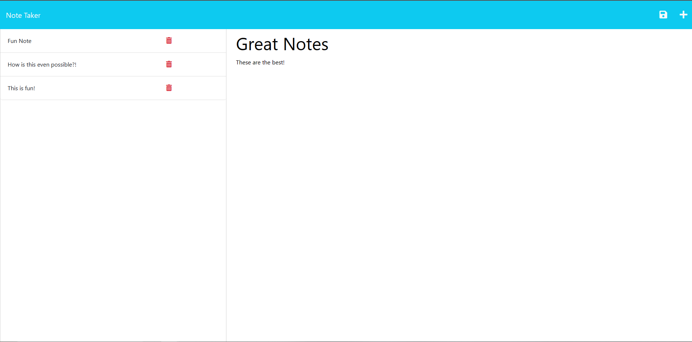

# Note Taker

## Description

This is Note Taker! If you ever had a hard time taking down notes Note Taker is for you! Note taker is designed to be an intuitive note taking app that quickly jots down notes as well as easily delete them. This application's back end uses express. This app does not use a database.

## Table of Contents
 - [Usage](#usage)
 - [Credits](#credits)
 - [License](#license)
 - [Questions](#questions)

## Usage

To start, go to [Note Taker](https://note-taker-production-e773.up.railway.app/) and click on get started. From there, you can click the plus at the top right and write down a note, then click on one of the notes to the right to view. Click the trash icon to delete.

## Credits

Creator: Gustavo Carrillo

## License

This project is under the MIT License

## Questions
     
Please contact me using the following

 - [GitHub Profile](https://github.com/0zrk23)
 - [Email](gus.carrillo1221@gmail.com)